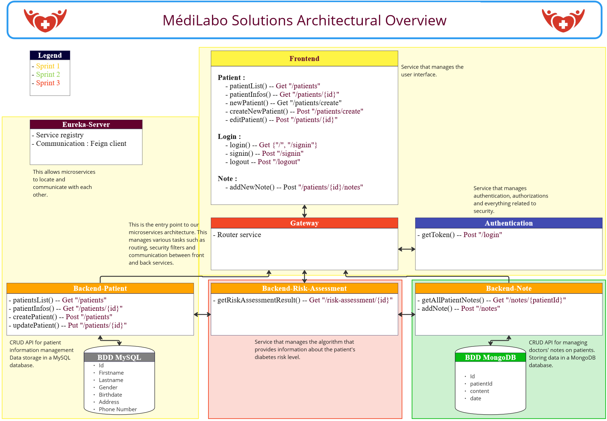

# Darves-Bornoz_Giovanni_MédiLabo_Solutions

MédiLabo_Solutions, an Openclassrooms project.
The application helps doctors detect diabetes in their patients based on information in their medical records.

## Technologies

* Java 17
* Maven
* Spring Boot 3.2.1
* Spring Boot Devtools
* Spring Boot Starter Actuator
* Spring Boot Configuration Processor
* Spring Boot Starter Test
* Springdoc Openapi Starter Webmvc UI 2.3.0
* Jacoco 0.8.11
* Lombok 1.18.30

### link to technologies specific to each module

* [Frontend-management](frontend-management/readme.md)
* [Gateway-management](gateway-management/readme.md)
* [Eureka-server](eureka-server/readme.md)
* [Authentication-service](authentication-service/readme.md)
* [Backend-patient-management](backend-patient-management/readme.md)
* [Backend-note](backend-note/readme.md)
* [Backend-risk-assessment](backend-risk-assessment/readme.md)

## Usage

1. Create docker images (refer to the next point, or for a specific module, go to its readme) 
2. Run the docker-compose.yml
    * Use the console, go to the main directory and run the command:

             docker-compose up

3. Go to http://localhost:8080/
4. Try to connect using this Username/Password

          "admin" - "admin".
5. On the main page you can view the list of patients.
6. You can click “Add Patient” to add a new patient.
7. You can click “Edit” to inspect a specific patient and view their risk assessment, edit it, or add a note.

### Docker databases images

* Mysql :
    * Use the console, go to "database-sql" directory and run the command:

          docker build -t mysql .
* MongoDB :
    * Use the console, go to "database-nosql" directory and run the command:

          docker build -t mongodb .

### Connections :

* Mysql port : 3306
* MongoDB port : 27017

#### Exposed port for each module :

* Frontend-management : 8080
* Gateway-management : 9002
* Eureka-server : 9102
* Authentication-service : 9004
* Backend-patient-management : 9001
* Backend-note : 9005
* Backend-risk-assessment : 9006

## Global overview architecture

## Screenshot

### Login page

### List of all patients

### Patient creation page

### Patient details page

